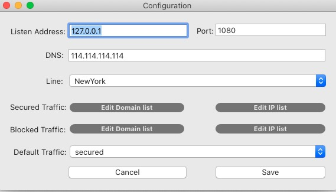

## HyperGate

A fast, stable and secured networking proxy(socks5) system.

HyperGate take a strong encryption of your outgoing packets. And provides a lot  of traffic lines all over the world to speed up your network access. 

## What's the difference between ShadowSocks?

HyperGate uses different encryption method than shadowsocks, and it is much safer than ss. Also, hypergate not only provides PAC mode and global mode proxy, but also provides rule based traffic routing, both support ip and domain, and AD block.

Also, hypergate provide multipule traffic lines for users to accelerate networking speed all over the world. 

## Quick Guide
The configuration of hypergate is strainghtforward, run the client, enter a valid license key.

### Global Mode
Run the client ,open cofiguration window, click the secured domain or ip list button, enter domain or ip address that you want to be secured, save configuration, then restart service(stop, start) to make it take effect.

second, change your network proxy type to socks, enter the address and port of hypergate client listening(default is 127.0.0.1:1080), done.

### PAC mode
HyperGate has a default light weight web server launched when client starts. Click PAC->PAC Address, Get current pac address and configurate this address to your system network proxy settings, Proxy type is PAC Mode. and the start the sevice.

you can edit the pac list and then just reconfigure the system proxy setting to take effect.

## Support & Contact

Submit an issue when you have any problems, or send mail to admin at hypergate.io, license key can only be acquired through mail.

